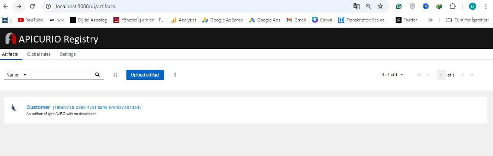
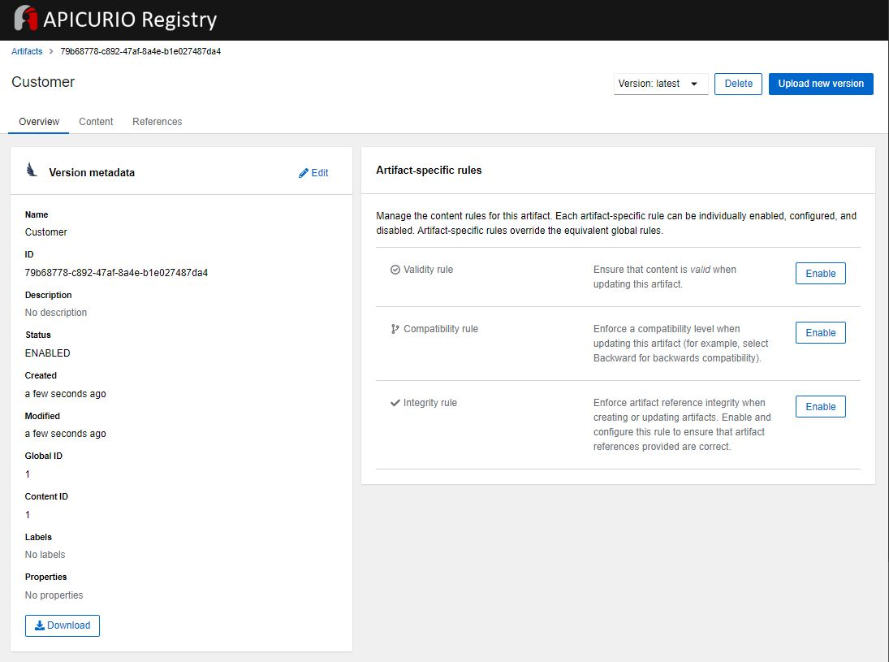
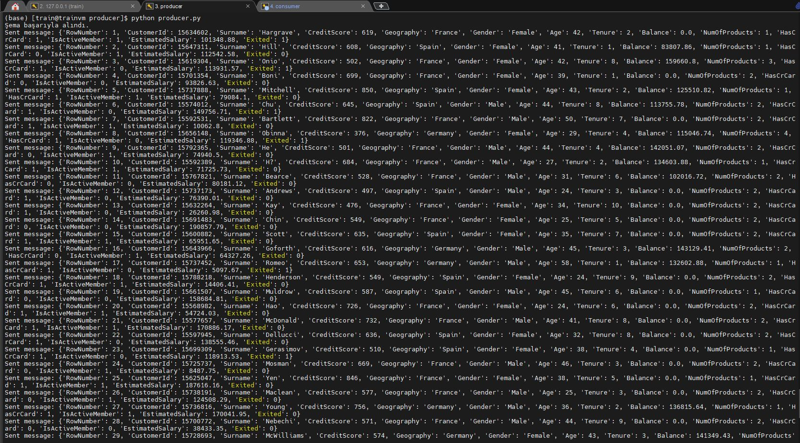
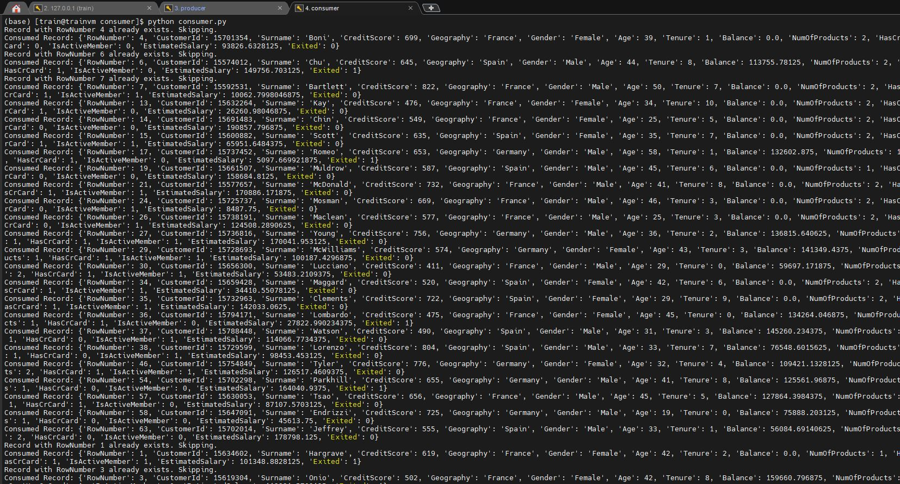

# Apicurio Schema Registry Steps

## Create Environment for Project
```
python3 -m venv schema_project
source schema_project/bin/activate
```
### Install requirements

```
pip install -r requirements.txt
```

## Docker Setup

- Start docker

```
sudo systemctl start docker
```
- Build docker-compose

```
docker-compose up --build -d 
```

This docker-compose file sets up an Apicurio Schema Registry with its required supporting services. Below is a brief explanation of each service and its configuration.

Services and Core Functions

```Kafka:``` Kafka serves as a messaging platform that integrates with Apicurio Schema Registry to manage data andschemas.

```PostgreSQL:``` Acts as a relational database to store data.

```Apicurio Registry (apicurio-registry-kafkasql):``` The core component of Apicurio Schema Registry that manages schemas with Kafka.

```Apicurio Registry UI (apicurio-registry-ui):``` Provides a graphical user interface for Apicurio, allowing users to manage schemas visually. Depends on the apicurio-registry-kafkasql service and enables easier schema management via the UI.

- Check your containers 
```
docker ps 
```
```commandline 
(schema_project) (base) [train@trainvm schema_registry]$ docker ps
CONTAINER ID   IMAGE                                               COMMAND                  CREATED          STATUS          PORTS                                                                               NAMES
d13cb6f6ac39   apicurio/apicurio-studio-ui:0.2.62.Final-announce   "/usr/local/s2i/run"     27 seconds ago   Up 25 seconds   8080/tcp, 8443/tcp, 8778/tcp, 9779/tcp, 0.0.0.0:8081->8081/tcp, :::8081->8081/tcp   schema_registry-apicurio-registry-ui-1
6fd76315c36f   apicurio/apicurio-registry-kafkasql:2.6.5.Final     "/opt/jboss/containe…"   27 seconds ago   Up 25 seconds   8443/tcp, 8778/tcp, 0.0.0.0:8080->8080/tcp, :::8080->8080/tcp, 9779/tcp             schema_registry-apicurio-registry-kafkasql-1
66f478f6b4b5   kafka:3.8.0                                         "start-kafka.sh"         27 seconds ago   Up 26 seconds   0.0.0.0:9092->9092/tcp, :::9092->9092/tcp                                           kafka
54bcb258c159   postgres:15-bullseye                                "docker-entrypoint.s…"   27 seconds ago   Up 26 seconds   0.0.0.0:5432->5432/tcp, :::5432->5432/tcp                                           schema_registry-postgresql-1
```

- check your port setting (Oracle VM > Settings > Network > Advanced > Port Forwarding)
- If port forwarding does not exist, add it. (ex: for kafka - 9092)
- You can access the Apicurio interface from your local PC browser at http://localhost:8080/

## Create and run schema py

This ```schema_registration.py``` file allows saving an Avro schema to the Apicurio Registry. By doing so, it stores the definition of a specific data structure in Apicurio, enabling data flow and validation.

```
python schema_registration.py
```

```commandline 
'Şema başarıyla kaydedildi.'
```

- You can see your schema id http://localhost:8080/ 





# Create Producer and Consumer directory/py

- Open 2 new tabs. One for producer, the other for consumer.

- First step run Producer

This ```producer.py``` file uses the ```Customer``` Avro schema registered in Apicurio Registry to send customer information from the ```Churn_Modelling.csv``` dataset to a Kafka topic named ```churn-topic``` in Avro format. The ```churn-topic``` Kafka topic is created within this file, and data is sent to Kafka at two-second intervals.

```
python producer.py
```



- Second step run Consumer

This ```consumer.py``` file reads messages from the Kafka topic ```churn-topic``` using the ```Customer``` Avro schema from Apicurio Registry. Each message is decoded from Avro format and stored in the ```ChurnTable``` table in PostgreSQL. New records are added to the database, while existing records are skipped.

```
python consumer.py
```



## Connect Postgres Container

```
docker exec -it schema_registry-postgresql-1 bash
```
```root
psql -U myuser -d mydatabase
```

```commandline(postgres-mydatabase=#) 
mydatabase=# \dt
          List of relations
 Schema |    Name    | Type  | Owner
--------+------------+-------+--------
 public | churntable | table | myuser
(1 row)
```
```
mydatabase=# select * from churntable limit(5);
```

```commandline(postgres-mydatabase=#) 
 RowNumber | CustomerId | Surname  | CreditScore | Geography | Gender | Age | Tenure |    Balance     | NumOfProducts | HasCrCard | IsActiveMember | EstimatedSalary | Exited
-----------+------------+----------+-------------+-----------+--------+-----+--------+----------------+---------------+-----------+----------------+-----------------+--------
         3 |   15619304 | Onio     |         502 | France    | Female |  42 |      8 |  159660.796875 |             3 |         1 |              0 |  113931.5703125 |      1
         1 |   15634602 | Hargrave |         619 | France    | Female |  42 |      2 |              0 |             1 |         1 |              1 |  101348.8828125 |      1
         2 |   15647311 | Hill     |         608 | Spain     | Female |  41 |      1 |   83807.859375 |             1 |         0 |              1 |   112542.578125 |      0
         4 |   15701354 | Boni     |         699 | France    | Female |  39 |      1 |              0 |             2 |         0 |              0 |   93826.6328125 |      0
         5 |   15737888 | Mitchell |         850 | Spain     | Female |  43 |      2 | 125510.8203125 |             1 |         1 |              1 |   79084.1015625 |      0
(5 rows)
```